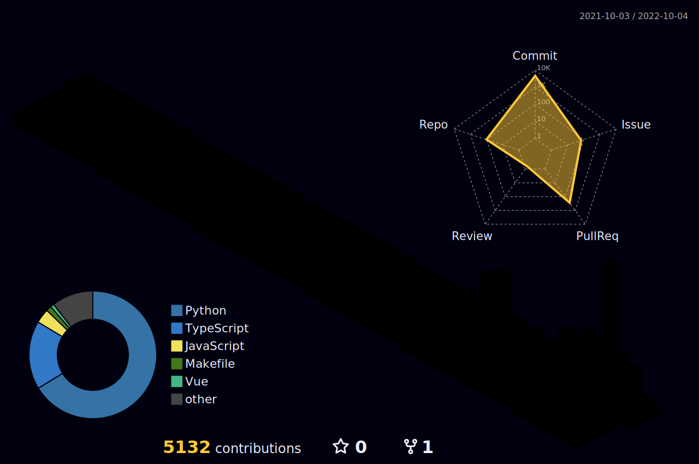

<!--  -->

<h4>
  
  Programmer (Nestjs Developer)
</h4>

  
  
  

#### Profile in English: <kbd></kbd>

| **About Me**                                                    |
|-----------------------------------------------------------------|
| My name is Estevam Souza from Brazil (🇧🇷).                      |
| I'm passionate about open source projects and I've always loved to produce a lot of content during my career. I am an enthusiastic JavaScript developer who loves solving difficult technical issues. |
| **Specialties**                                                  |
| TypeScript, JavaScript, Node, Nest, Express                       |
| **Favorite Framework**                                           |
| [Framework Name]                                                  |
| **Interests**                                                    |
| In my free time, I enjoy playing (and watching) soccer (⚽️), watching movies (🎞️) and series (📺), reading books (📚), listening to music (🎵), and occasionally philosophizing about life with a whisky (🍺).

<!-- 	
	<a href="https://github.com/estevam5s">
		 -->
	

<!-- 
 -->
<!--    -->
<!-- 	
	
	
	
	 -->
<!-- 	 -->

<!-- --- -->

 

<!-- ### 🧰 Languages and Tools
 -->
<!--  -->

  <tr>
    </td>
    <td align="center" width="35">
      
    </td>
    <td align="center" width="35">
      
    </td>
    <td align="center" width="35">
      
    </td>
    <td align="center" width="35">
      
    </td>
    <td align="center" width="35">
      
    </td>
    <td align="center" width="35">
      
    </td>
    <td align="center" width="35">
      
    </td>
    <td align="center" width="35">
      
    </td>
    <td align="center" width="35">
      
    </td>
    <td align="center" width="35">
      
    </td>
    <td align="center" width="35">
        
    </td>
    <td align="center" width="35">
      
    </td>
    <td align="center" width="35">
        
    </td>
    <td align="center" width="35">
        
    </td>
    <td align="center" width="35">
        
    </td>
    <td align="center" width="35">
        
    </td>
    <td align="center" width="35">
        
    </td>
    <td align="center" width="35">
        
    </td>
    <td align="center" width="35">
    	
    </td>
    <td align="center" width="35">
	
    </td>
  </tr>
  <tr>
  </tr>

<!-- 

   
   
<b>📊 Stats</b>

  
  

     

<!--  -->

<!--  -->

<!-- ## 🤝 Feel free to Connect with me :

 -->

<!--  -->
<!-- 

 -->
## :sparkling_heart: Support the project 

I open-source almost everything I can, and I try to reply to everyone needing help using these projects. Obviously,
this takes time. You can use this service for free.

However, if you are using this project and are happy with it or just want to encourage me to continue creating stuff, there are a few ways you can do it:-

- Giving proper credit when you use github-readme-stats on your readme, linking back to it :D
- Starring and sharing the project :rocket: I'll probably buy a ~~coffee~~ tea. :tea:

if you like what i do, maybe consider buying me a coffee/tea 🥺👉👈

<!-- Give a ⭐️ if this project helped you!

<!-- ko-fi icon -->

<!--  -->

<!-- liberapay icon -->

<!-- 
 -->
<!-- opencollective icon -->

<!--  -->

<!-- issuehunt icon -->

<!--  -->

<!--  -->
<!--  -->
<!--  -->

