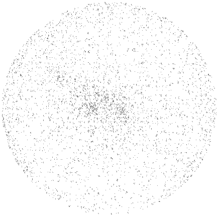
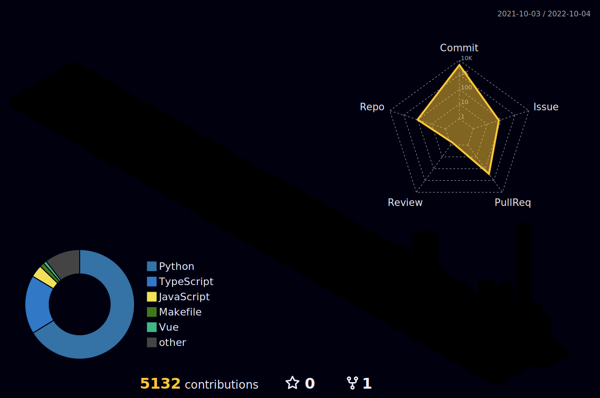

<h3 align="center">
	 
	
	Github Readme Stats</a> 

	
</h3>

            

<!--

	
	
	

-->

<!-- 

  
   
   
  
   

-->

<!-- 

 -->

 

<h1 align="center"><b>Welcome to my world! </b></h1> 
 

  

<!--

  

 

-->

### Hi there! 

    

 Thank you for having a look at my profile

My name is Estevam Souza from Brazil (🇧🇷). I'm passionate about open source projects and I've always loved to produce a lot of content during my career

I am an enthusiastic JavaScript developer who loves solving difficult technical issues.
TypeScript, JavaScript, Node, Nest, Express are my specialists.

My favorite Framework is the &emsp; 

In my free time I like to play (and watch) soccer (⚽️), to watch movies (🎞️) and series (📺), to read books (📚), to listen to music (🎵) and eventually I like to philosophize about life with a whisky (🍺)

 &emsp; Would you like to find me?

<!--    -->
	
	
	
	
	
<!-- 	 -->

</a>

 

<!--  -->

<!-- ## Achievements

<table>
<tr>
<td align="center"></td>
<td align="center"></td>
<td align="center"></td>
<td align="center"></td>
<td align="center"></td>
<td align="center"></td>
<td align="center"></td>
<td align="center"></td></a>
<td align="center"></td></a>
<td align="center"></td></a>
<td align="center"></td></a>
</tr>
</table>
-->

  

&nbsp;&nbsp;&nbsp;

### 🎓 Currently learning

- MERN Stack Web Development    
<!--   * Full Stack Django Development   -->

## 🤯 Languages and Tools:

## 🤯 Extra Stuff:

### 🖥️ Technologies

  </ > 

<h1 align="center"><i><b>Profile Cards</b></i></h1>

<!--

<i><b>Stack Overflow</b></i>

 -->

<!-- 
<i><b>Leetcode</b></i>

  

 -->

   
   
<b>🥉 Metrics</b>

  	

![Metrics](https://metrics.lecoq.io/estevam5s?template=classic&base.header=0&base.activity=0&base.community=0&base.repositories=0&base.metadata=0&isocalendar=1&stargazers=1&lines=1&topics=1&stars=1&habits=1&followup=1&reactions=1&people=1&introduction=1&sponsors=1&repositories=1&discussions=1&starlists=1&calendar=1&achievements=1&notable=1&activity=1&traffic=1&code=1&gists=1&projects=1&pagespeed=1&tweets=1&anilist=1&music=1&posts=1&rss=1&wakatime=1&fortune=1&nightscout=1&poopmap=1&screenshot=1&base=header%2C%20activity%2C%20community%2C%20repositories%2C%20metadata&base.indepth=false&base.hireable=false&repositories.batch=100&repositories.forks=false&repositories.affiliations=owner&isocalendar=false&isocalendar.duration=full-year&stargazers=false&stargazers.charts=true&stargazers.charts.type=classic&stargazers.worldmap=false&stargazers.worldmap.sample=0&lines=false&lines.sections=base&lines.repositories.limit=4&lines.history.limit=1&topics=false&topics.mode=starred&topics.sort=stars&topics.limit=15&stars=false&stars.limit=4&habits=false&habits.from=200&habits.days=14&habits.facts=true&habits.charts=false&habits.charts.type=classic&habits.trim=false&habits.languages.limit=8&habits.languages.threshold=0%25&followup=false&followup.sections=repositories&followup.indepth=true&followup.archived=true&reactions=false&reactions.limit=200&reactions.limit.issues=100&reactions.limit.discussions=100&reactions.limit.discussions.comments=100&reactions.days=0&reactions.display=absolute&people=false&people.limit=24&people.identicons=true&people.identicons.hide=true&people.size=28&people.types=followers%2C%20following&people.shuffle=false&introduction=false&introduction.title=true&sponsors=false&sponsors.sections=goal%2C%20list%2C%20about&sponsors.past=false&sponsors.size=24&sponsors.title=Sponsor%20Me!&repositories=false&repositories.pinned=0&repositories.starred=0&repositories.random=0&repositories.order=featured%2C%20pinned%2C%20starred%2C%20random&discussions=false&discussions.categories=true&discussions.categories.limit=0&starlists=false&starlists.limit=2&starlists.limit.repositories=2&starlists.languages=true&starlists.limit.languages=8&starlists.shuffle.repositories=true&calendar=false&calendar.limit=1&achievements=false&achievements.threshold=S&achievements.secrets=false&achievements.display=detailed&achievements.limit=0&notable=false&notable.from=organization&notable.repositories=true&notable.indepth=true&notable.types=commit&activity=false&activity.limit=5&activity.load=300&activity.days=14&activity.visibility=all&activity.timestamps=true&activity.filter=all&traffic=false&code=false&code.lines=12&code.load=400&code.days=3&code.visibility=public&gists=false&projects=false&projects.limit=4&projects.descriptions=true&pagespeed=false&pagespeed.url=.user.website&pagespeed.detailed=true&pagespeed.screenshot=true&pagespeed.pwa=true&tweets=false&tweets.user=.user.twitter&tweets.attachments=false&tweets.limit=2&anilist=false&anilist.user=.user.login&anilist.medias=anime%2C%20manga&anilist.sections=favorites&anilist.limit=2&anilist.limit.characters=22&anilist.shuffle=true&music=false&music.user=.user.login&music.limit=4&music.played.at=true&music.time.range=short&music.top.type=tracks&posts=false&posts.user=.user.login&posts.descriptions=true&posts.covers=true&posts.limit=4&rss=false&rss.limit=4&wakatime=false&wakatime.url=https%3A%2F%2Fwakatime.com&wakatime.user=current&wakatime.sections=time%2C%20projects%2C%20projects-graphs%2C%20languages%2C%20languages-graphs%2C%20editors%2C%20os&wakatime.days=7&wakatime.limit=5&wakatime.languages.other=true&wakatime.repositories.visibility=all&fortune=false&nightscout=false&nightscout.url=https%3A%2F%2Fexample.herokuapp.com&nightscout.datapoints=12&nightscout.lowalert=80&nightscout.highalert=180&nightscout.urgentlowalert=50&nightscout.urgenthighalert=250&poopmap=false&poopmap.days=7&screenshot=false&screenshot.title=Screenshot&screenshot.selector=body&screenshot.background=false&config.timezone=America%2FSao_Paulo)

   
   
<b>🥉My DevSetup</b>

    
    
    
    

  <ul>
  	  <li><b>OS:</b> Arch Linux (Garuda)</li>
	  <li><b>Laptop: </b> Lenovo</li>
  	  <li><b>CPU: </b> 2,3 GHz Intel Core i5 8-Core</li>
	    <li><b>GPU: </b> Intel UHD Graphics 630 1536 MB</li>
	    <li><b>RAM:</b> 8 GB 2400 MHz DDR4</li>
   </ul>	

   
   
<b>🥇 Github Stats</b>

	

  
  
  

     

<!--  -->

<!--  -->

<!-- ## 🤝 Feel free to Connect with me :

 -->

	
  
<b>🥇 Github Streaks</b>

### 🐍 Watch a Snake eat my Contribution Graph :

 

 

 

 

        

	
  
<b>🥈 Organizations</b>

### Organizations that I have contributed to :

	<b>Do you like my contributions ? Nominate me for <a href='https://stars.github.com/nominate/'>Github Stars ⭐</a></b>

## :sparkling_heart: Support the project 

I open-source almost everything I can, and I try to reply to everyone needing help using these projects. Obviously,
this takes time. You can use this service for free.

However, if you are using this project and are happy with it or just want to encourage me to continue creating stuff, there are a few ways you can do it:-

- Giving proper credit when you use github-readme-stats on your readme, linking back to it :D
- Starring and sharing the project :rocket:
-  - You can make one-time donations via PayPal. I'll probably buy a ~~coffee~~ tea. :tea:

if you like what i do, maybe consider buying me a coffee/tea 🥺👉👈

Give a ⭐️ if this project helped you!

<!-- ko-fi icon -->

<!-- liberapay icon -->

<!-- opencollective icon -->

<!-- github sponsors icon -->

<!-- issuehunt icon -->

🚧 **my todoist stats:**

<!-- TODO-IST:START -->

🏆 7,995 Karma Points  
🌸 Completed 0 tasks today  
✅ Completed 673 tasks so far  
⏳ Longest streak is 10 days

<!-- TODO-IST:END -->

Thanks! :heart:

## Licença

[MIT](/LICENSE) &copy;

